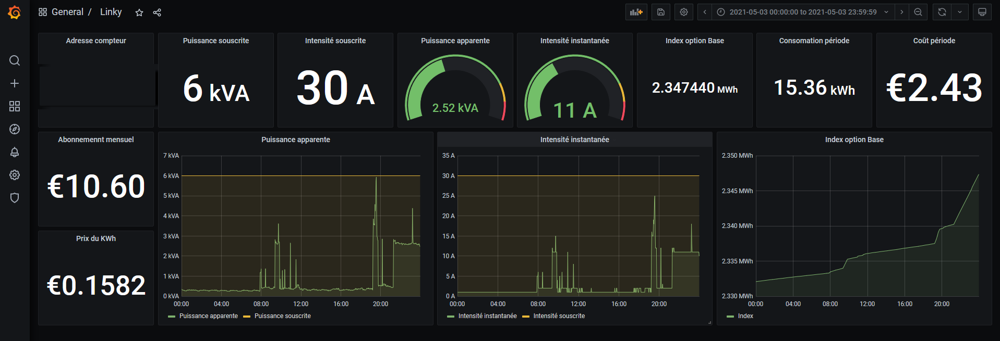

# Linky-Exporter

## Description

Exporter Prometheus des trames remontées à partir d'un module téléinfo raccordé sur un compteur Linky.

## Variable d'environement

| Variable d'environement  | Description                          | Valeur par défaut |
|--------------------------|--------------------------------------|-------------------|
| LINKY_EXPORTER_INTERFACE | Interface d'accès au compteur Linky  | /dev/ttyUSB0      |
| LINKY_EXPORTER_LOGLEVEL  | Niveau de verbosité de l'exporter    | INFO              |
| LINKY_EXPORTER_NAME      | Valeur 'job' des métriques remontées | linky-exporter    |
| LINKY_EXPORTER_PORT      | Port d'écoute de l'exporter          | 8123              |
| LINKY_EXPORTER_MODE      | Mode HISTORIQUE ou STANDARD          | HISTORIQUE        |

## Format des métriques

Les métriques remontées par l'exporter sont toutes préfixées par la chaine de caractère : **'linky_'**.

Par exemple, l'index de base est disponible à travers la métrique : **linky_base**.

```bash
# HELP linky_isousc Intensité Souscrite en A
# TYPE linky_isousc gauge
linky_isousc{adco="xxxxxxxxxxx",hhphc="A",imax="090",job="linky-exporter",motdetat="000000",optarif="BASE",ptec="TH.."} 30.0
# HELP linky_base_total Index Option Base en Wh
# TYPE linky_base_total counter
linky_base{adco="xxxxxxxxxxx",hhphc="A",imax="090",job="linky-exporter",motdetat="000000",optarif="BASE",ptec="TH.."} 2.35478e+06
# HELP linky_iinst Intensité Instantanée en A
# TYPE linky_iinst gauge
linky_iinst{adco="xxxxxxxxxxx",hhphc="A",imax="090",job="linky-exporter",motdetat="000000",optarif="BASE",ptec="TH.."} 11.0
# HELP linky_papp Puissance Apparente en VA
# TYPE linky_papp gauge
linky_papp{adco="xxxxxxxxxxx",hhphc="A",imax="090",job="linky-exporter",motdetat="000000",optarif="BASE",ptec="TH.."} 2610.0
````

## Lancement de l'exporter

L'exporter est "packagé" sous forme de conteneur Docker.

Une fois le conteneur construit, il peut être lancé comme suit :

`docker run -dit --device=/dev/ttyUSB0 -v /dev/ttyUSB0:/dev/ttyUSB0 -p 8123:8123 linky-exporter`

## Tableau de bord Grafana

Un tableau de bord Grafana est disponible dans le répertoire **grafana** et permet l'exploitation des métriques remontées par l'exporter.

_Capture d'écran :_


[capture d'écran Grafana](grafana/grafana.png "Capture d'écran Grafana")
